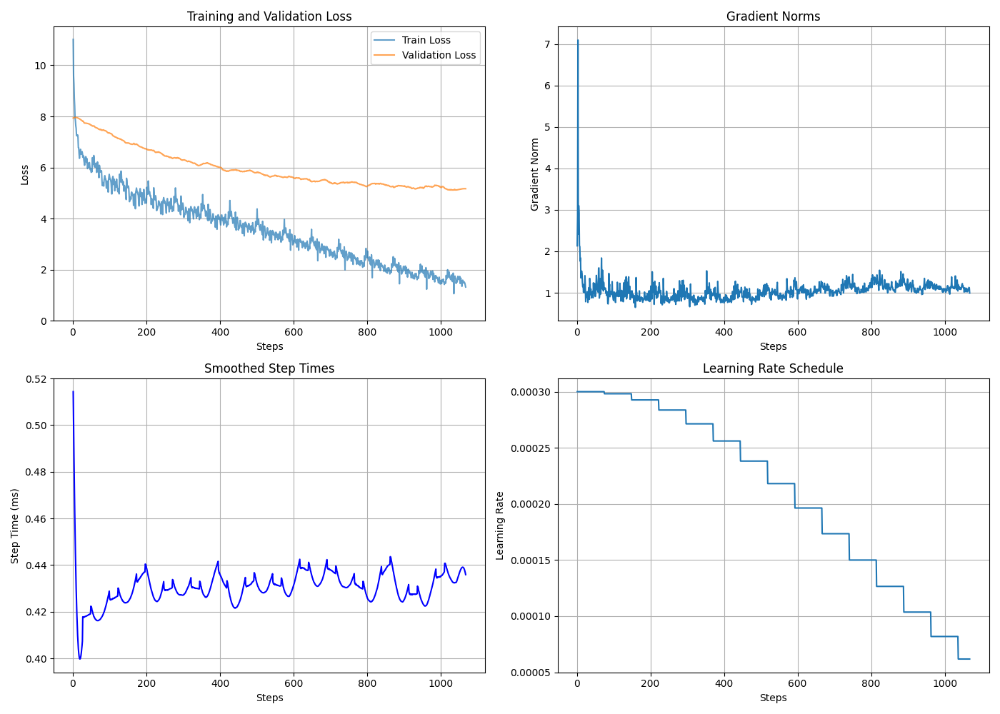

# SmallGPT 
SmallGPT is a project focused on exploring and optimizing large language models (LLMs) by leveraging the GPT-2 architecture to generate text in the style of Shakespeare.

- We use the shakespere dataset usually used by Andrej karpathy because its easier to manage and its also quite small 
- The model is very small , with  134-Million  parameter 
- We train the model on A10G GPU 

# Examples 
The model does generate coherent text but it does not really grasp the full context of the prompt

| Prompt                                  | Generated Text                                                                 |
|-----------------------------------------|---------------------------------------------------------------------------------|
| First Citizen:Very well; and could be content to give him good report fort, but that he pays himself with being proud. Second Citizen:| Second Citizen:My lord, so is But your grace's a manhood,And in your grace that name,Your native king,And by their own have done:And with a Christian climate;And in their hearts. |
| All:Come, come.First Citizen:What, thou?  | Second Murderer:Why, then, then, then you a king?Second Murderer:Wherein your cousin?First Murderer:What is a duke?|
| All: |my lord, for our cousin,And that we'll prove so shall we are.KING RICHARD II:A man, as my heart.QUEEN MARGARET:So, my lord|


# Get Started 

You can try the model I train 
- First you might actually want to clone this repo 
```bash 
!git clone https://github.com/dame-cell/SmallGPT.git
cd SmallGPT
```
- Install the library 
```bash 
pip install -r requirements.txt 
cd model 
```
- Download the model from huggingface 

```python 
from huggingface_hub import hf_hub_download
hf_hub_download(repo_id="damerajee/smallgpt", filename="model.pt")
```

- And then try it out 
```python 
from generate import generate,text_to_token_ids , token_ids_to_text
from modeling_gpt2 import GPT2 ,GPTConfig 
import torch 

GPT_CONFIG = {
    "vocab_size": 50257,
    "context_len": 256,
    "emb_dim": 768,
    "num_heads": 12,
    "num_layers": 12,
    "drop_rate": 0.1,
    "qkv_bias": False,
}
model = GPT2(GPT_CONFIG)
device = torch.device("cuda" if torch.cuda.is_available() else "cpu")
model.load_state_dict(torch.load("path_to_model", map_location=device))
model.to(device)
import tiktoken 
tokenizer = tiktoken.get_encoding("gpt2")

text = "First citizen:"

token_ids = generate(
                    model=model,
                    device=device,
                    idx=text_to_token_ids(text, tokenizer),
                    max_new_tokens=50,
                    context_len=GPT_CONFIG["context_len"],
        )
        
print(token_ids_to_text(token_ids, tokenizer))
``` 
# Hyper-Parameters 
For training the Model I wanted to optimize it as much as I can increasing the speed of the training tho it does not really matter because the data is too small but even so i tried to increase the speed specifically the amount of tokens the model process per mili-seconds

So here we talk about the Hyper-Parameters I chose and the optimizers i used 

| **Hyperparameter**       | **Value**          |
|--------------------------|--------------------|
| **Epochs**               | 15                 |
| **Learning Rate**        | 3e-4               |
| **Batch Size**           | 16                 |
| **Evaluation Interval**  | 70                |
| **Weight Decay**         | 0.1                |
| **Scheduler T_max**      | 15 (Number of Epochs) |
| **Gradient Clip Norm**   | 1.0                | 

All the above are the Hyper-Parameters used during training 

## Optimizing the code 
When training the model without any optmization techinques it took about 20 mins to complete the entire trianing but with optimization techinques it took only about 8 mins 

Optimizations Used:

- torch.compile: This increase the speed of the training by a large fold It helps in speeding up the training process by leveraging PyTorch's JIT compilation features.

- Learning Rate Scheduler: For the learning rate ,I tried to just a constant learning rate  but then decided to used `torch.optim.lr_scheduler.CosineAnnealingL` , This can help in converging faster by reducing the learning rate as training progresses, leading to smoother convergence.

- Gradient Clipping:  This technique is used to prevent exploding gradients by clipping the gradients to a maximum norm. This helps in stabilizing training, especially when using large models or high learning rates.

# Obvervations 

<p align="center">
  
</p>

- When I tried training the model , the train loss decrease gradually as we kept training it , but the val loss became more constant which make sense  

- Based on the plots you can tell that the gradient norms start very high and then decrease rapidly, indicating that the initial gradients were very large. After the initial decrease, the gradient norms stabilize at a lower level, suggesting that the model has converged to a stable state. 

- The step times start very high and then decrease rapidly, indicating that the initial steps took longer to compute. After the initial decrease, the step times stabilize at a lower level, suggesting that the computation time per step has become consistent.

- The learning rate decreases at regular intervals, which is a common practice to help the model converge more smoothly and avoid overshooting the minimum.

I tried to do Mixed-precision training but somehow that affected my training and the model started NaN for train loss and val loss 

The other thing I noticed is that training the model on a very low learning rate will actually cause the model to not learn anything even after 12 epochs I found that keeping it at `3e-4`  makes it converges faster  

# Conclusion 
This code is just a learning step for me ,I wanted to code my own Small-Language model(that can at the most generate coherent texts) while also trying to learn how to optimize my code although it's not perfect but I feel like I learn a lot.
